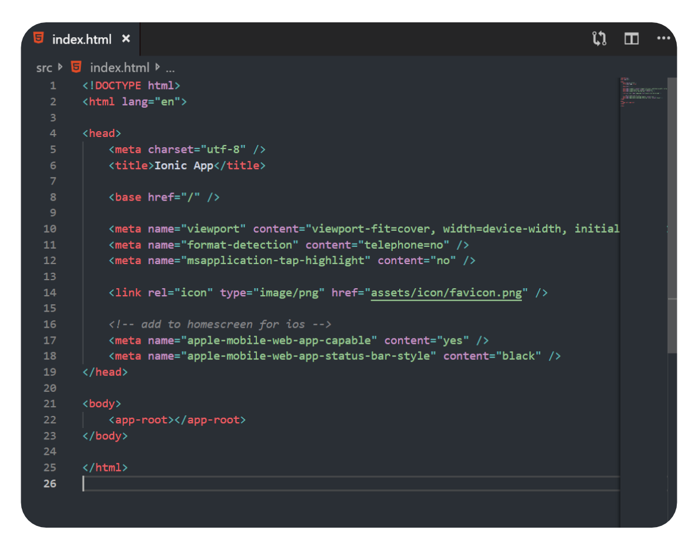

# [Vulcan Theme](https://marketplace.visualstudio.com/items?itemName=TobGr.vulcan-theme)

A simple dark theme for VS Code

## Installation
1. Open **Extensions** sidebar panel in Visual Studio Code. `View → Extensions`
1. Search for `Vulcan Theme`
1. Click **Install**
1. File > Preferences > Color Theme > **Vulcan Theme**

## Screenshots

