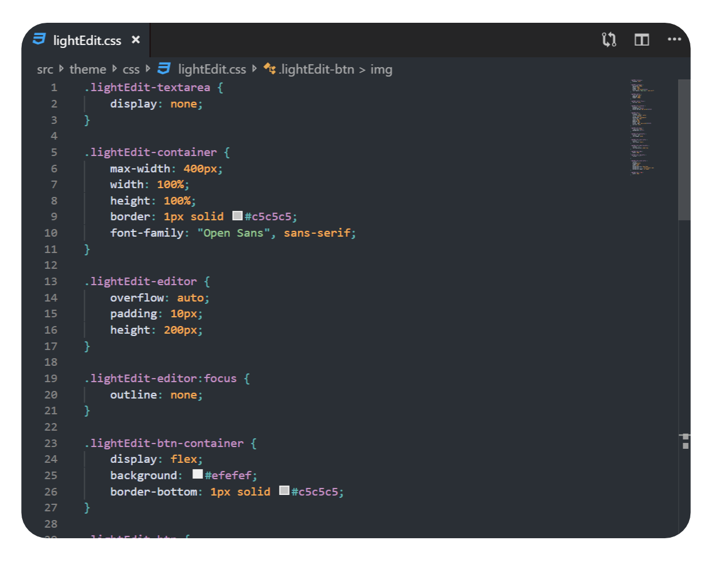
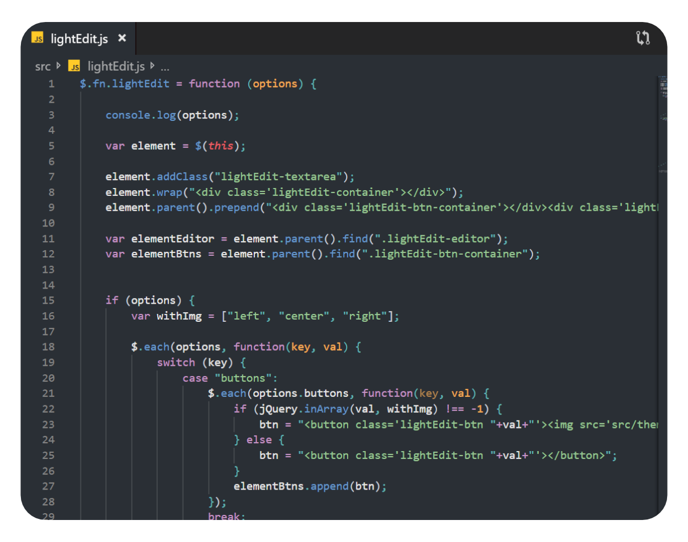

# [Vulcan Theme](https://marketplace.visualstudio.com/items?itemName=TobGr.vulcan-theme)

A simple dark theme for VS Code

If you think something could be improved or find a bug, please open an [issue](https://github.com/TobGr/Vulcan-Theme/issues).

[GitHub repository](https://github.com/TobGr/Vulcan-Theme)

## Installation
1. Open **Extensions** sidebar panel in Visual Studio Code. `View → Extensions`
1. Search for `Vulcan Theme`
1. Click **Install**
1. File > Preferences > Color Theme > **Vulcan Theme**

## Screenshots

### General design

### HTML

### CSS

### JavaScript

### TypeScript

